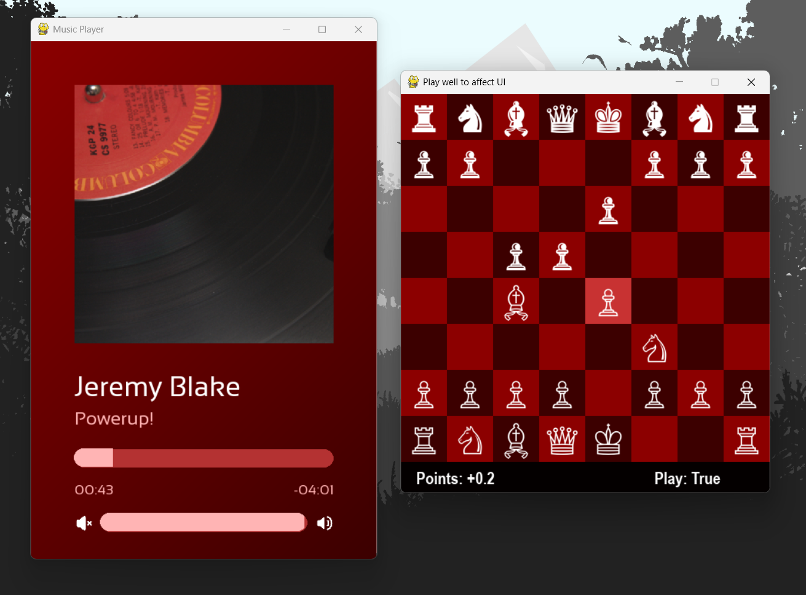

# (Grand) Master Audio
An audio player with a twist created for the University of Calgary's Computer Science Undergraduate Society (CSUS) 2026 Calgary Lacks Hackathon. 


## Why is this UI Terrible?
The controls of this audio player are dependent on your performance in a given chess game. Rather then the archaic, decades old components of sliders or buttons, chess allows fine control, and encourages brain activity in a time of AI slop. For instance, to increase the volume, simply reach a high board evaluation against stockfish. This should be *very* reasonable for any amateur chess hobbyist.
## Instalation
### Requirements
- Windows 11 (Windows 10 may also work, but not guaranteed)
- Python 3.11.3
### Cloning Repository
```bash
git clone https://github.com/gavgrub/CalLacks26.git
```
### Install dependencies
```bash
pip install python-chess, numpy, pygame
```
## Usage
Run the audio player with:
```bash
python main.py <relative path to audio file>
```
Example:
```bash
python main.py "songs/Powerup! - Jeremy Blake.mp3"
```
To run the player in normal mode (without chess controls):
```bash
python main.py -n <relative path to audio file>
```
Example:
```bash
python main.py -n "songs/Powerup! - Jeremy Blake.mp3"
```
## Credits
Created by Gavin Grubert
- Email: grubertgavin@gmail.com
- GitHub: [https://github.com/gavgrub](https://github.com/gavgrub)
Chess engine is Stockfish. Find authors under src/engine/AUTHORS
## License
I have licensed this project under CC BY-NC-SA 4.0, find the details here:
[https://creativecommons.org/licenses/by-nc-sa/4.0/](https://creativecommons.org/licenses/by-nc-sa/4.0/)
